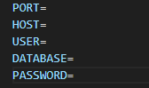
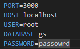
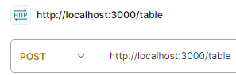
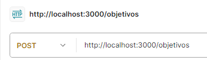
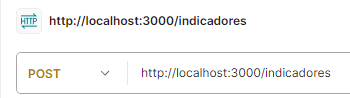
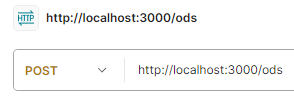
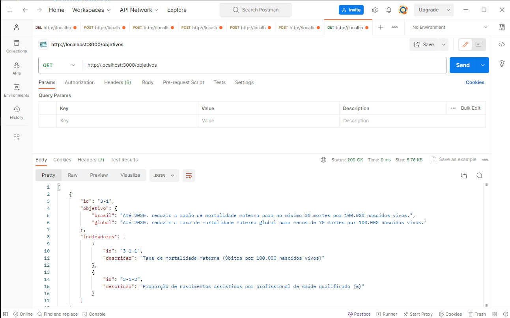
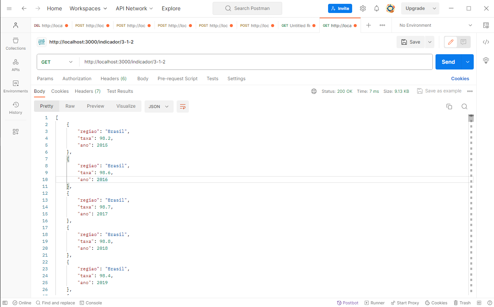

# microsservice-gs

## Nome dos integrantes: 

### 88747 - RAFAEL HIDEKI MURATA

### 87875 - Matheus Bettim Carvalho Neto

### 87243 - Renan Prado Gonzalez

## Como iniciar o projeto

### Vá para algum repositório do seu computador abra o Visual Studio Code, abra o terminal e digite git clone <https://github.com/rmuratah/microsservice-gs.git> e depois digite cd .\microsservice-gs\

### Digite npm install

### Para iniciar o projeto digite npm start

### Agora precisamos configurar o banco de dados do projeto, na raiz do projeto crie um arquivo .env

### Primeiro Baixe o mysqlworkbench <https://www.mysql.com/downloads/>

### E crie 5 variáveis PORT, HOST, USER, DATABASE, PASSWORD

### Agora preenchar com suas informações de conexão

### Agora crie as tabelas

### Agora vamos inserir os dados nas tabelas

### Primeiro vamos inserir as metas

### Primeiro vamos inserir as metas

### Primeiro vamos inserir os objetivos

### Primeiro vamos inserir os indicadores

### Primeiro vamos inserir os ods

### Para acessar os objetivos abra o postman e crie requisião get e cole esse endereço com sua porta <http://localhost:${SuaPorta}/objetivos>

### Para acessar os indicadores abra o postman e crie requisião get e cole esse endereço com sua porta <http://localhost:${SuaPorta}/indicador/${id}>

